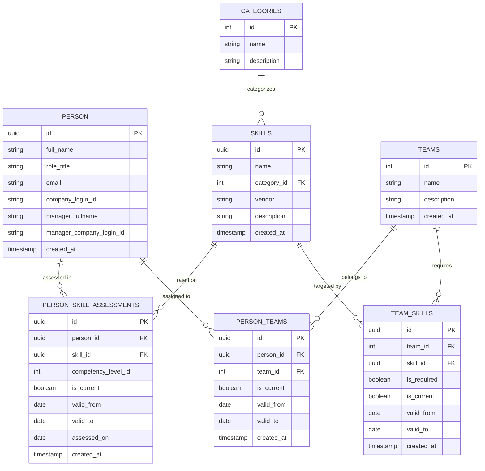

# Skills Matrix Application — User Guide & Feature Documentation

Welcome to the **Skills Matrix Application**, a modern, interactive web application engineered to track, manage, analyze, and visualize technical skills, team competencies, and capability gaps across your organization.

---

## 📋 Executive Overview

The **Skills Matrix Application** provides engineering managers, team leads, and HR leaders with complete visibility into the technical capabilities of their organization. By mapping team members against a catalog of tracked skills and competency levels (from 0 to 5 stars), the application enables data-driven decision-making for:

- **Resource Allocation & Project Staffing**: Quickly locate team members with specific technical mastery (e.g., Expert in React or Strong in PostgreSQL).
- **Skill Gap Identification**: Contrast team skill requirements against actual team capabilities to identify training needs or hiring priorities.
- **Team Capability Benchmarking**: Measure category-level and team-level proficiency metrics in real time.
- **Data Management & Governance**: Seamlessly import/export team rosters and connect to PostgreSQL via Supabase with full Row-Level Security (RLS).
- **Historical Progress Tracking**: Preserve immutable rating change histories using temporal boolean flags (`is_current = true / false`) to enable long-term team growth reports.

---

## 🏗️ Architecture & Design System

### Technical Stack
- **Frontend Core**: React 19, Vite, JavaScript (ES Modules).
- **Icons & Visuals**: Lucide React icon suite.
- **Styling & Theme**: Modern Vanilla CSS featuring a dark-mode **Glassmorphism Design System** with custom properties, smooth transitions, star rating widgets, and responsive layout containers.
- **Backend & Database**: Supabase PostgreSQL connection with fallback to an **Autonomous Demo Mode** featuring pre-populated mock datasets.
- **Code Quality**: Oxlint integration for fast linting.

---

## 🗄️ Database Architecture & Star Schema Specification

The database architecture is designed using a **Dimensional Data Modeling / Star Schema** pattern optimized for both fast online transactional queries (OLTP) and analytical progress reporting (OLAP).

### 📐 Entity-Relationship Star Schema Diagram

```ascii
+-----------------------+         +-------------------------------+         +-----------------------+
|        PERSON         |         |   PERSON_SKILL_ASSESSMENTS    |         |        SKILLS         |
+-----------------------+         +-------------------------------+         +-----------------------+
| id (PK, UUID)         |<------->| id (PK, UUID)                 |<------->| id (PK, UUID)         |
| full_name             |         | person_id (FK -> person)      |         | name                  |
| role_title            |         | skill_id (FK -> skills)       |         | category_id (FK)----->|-----+
| email                 |         | competency_level_id (1..5)    |         | vendor                |     |
| company_login_id      |         | is_current (BOOLEAN)          |         | description           |     |
| manager_fullname      |         | valid_from / valid_to (DATE)  |         +-----------------------+     |
| manager_login_id      |         | assessed_on (DATE)            |                                       |
+-----------------------+         +-------------------------------+                                       |
        ^                                                                                                 |
        |                         +-------------------------------+         +-----------------------+     |
        +------------------------>|         PERSON_TEAMS          |         |      CATEGORIES       |     |
                                  +-------------------------------+         +-----------------------+     |
                                  | id (PK, UUID)                 |         | id (PK, INT)          |<----+
                                  | person_id (FK -> person)      |         | name                  |
                                  | team_id (FK -> teams)-------->|----+    | description           |
                                  | is_current / valid_from/to    |    |    +-----------------------+
                                  +-------------------------------+    |
                                                                       v
                                  +-------------------------------+ +-----------------------+
                                  |          TEAM_SKILLS          | |         TEAMS         |
                                  +-------------------------------+ +-----------------------+
                                  | id (PK, UUID)                 | | id (PK, INT)          |
                                  | team_id (FK -> teams)---------->| name                  |
                                  | skill_id (FK -> skills)       | | description           |
                                  | is_required (BOOLEAN)         | +-----------------------+
                                  +-------------------------------+
```



---

### 🌟 Fact Tables vs. Dimension Tables

#### 1. Fact Tables (Event & Assessment Data)
- **`person_skill_assessments` (Periodic Assessment Fact Table)**:
  - **Granularity**: One record per developer assessment event per skill level change.
  - **Measures / Numerical Metrics**: `competency_level_id` (Integer rating from 1 = Basic to 5 = Expert).
  - **Foreign Key Dimensions**: `person_id` (FK -> `person.id`), `skill_id` (FK -> `skills.id`).
  - **Temporal Audit Attributes**: `is_current` (Boolean), `valid_from` (Date), `valid_to` (Date), `assessed_on` (Date).

- **`team_skills` (Team Requirement Fact Table)**:
  - **Granularity**: One record per team required skill rule.
  - **Foreign Key Dimensions**: `team_id` (FK -> `teams.id`), `skill_id` (FK -> `skills.id`).
  - **Attributes**: `is_required` (Boolean), `is_current` (Boolean), `valid_from` (Date), `valid_to` (Date).

- **`person_teams` (Team Assignment Fact / Bridge Table)**:
  - **Granularity**: One record per person team placement period.
  - **Foreign Key Dimensions**: `person_id` (FK -> `person.id`), `team_id` (FK -> `teams.id`).
  - **Attributes**: `is_current` (Boolean), `valid_from` (Date), `valid_to` (Date).

#### 2. Dimension Tables (Context & Attributes)
- **`person` (Developer Dimension)**: Stores personnel context (Full Name, Role Title, Email, Company Login ID, Manager reporting attributes).
- **`skills` (Skill Dimension)**: Stores catalog metadata (Skill Name, Vendor, Description, Foreign Key to Category).
- **`categories` (Taxonomy Dimension)**: Defines higher-level skill domains (Frontend, Backend, Database, DevOps, etc.).
- **`teams` (Organizational Team Dimension)**: Stores team names and descriptions.

---

### 🔑 Key Database Technical Highlights

1. **Surrogate Keys & UUID Primary Keys**:
   - Uses UUID primary keys generated via `gen_random_uuid()` for `person`, `skills`, `person_skill_assessments`, `person_teams`, and `team_skills`. This eliminates key collision issues across distributed environments, APIs, and CSV imports.
   - Uses integer surrogate keys (`SERIAL`) for static lookup dimensions (`categories`, `teams`).

2. **Referential Integrity & Cascading**:
   - Foreign keys enforce strict relational integrity with `ON DELETE CASCADE` clauses (e.g., deleting a person automatically cleans up their assessments and team junction records without leaving orphaned data).

3. **Row-Level Security (RLS)**:
   - All tables enforce PostgreSQL Row-Level Security (`ALTER TABLE ... ENABLE ROW LEVEL SECURITY`).
   - Declarative security policies govern public/authenticated read, insert, update, and delete access.

4. **Recommended Database Indexes**:
   For large-scale enterprise deployments, the following composite indexes optimize query performance:
   ```sql
   -- Optimize current active assessment queries for matrix loading
   CREATE INDEX idx_psa_current ON person_skill_assessments (person_id, skill_id) WHERE is_current = true;
   
   -- Optimize historical temporal queries for progress reporting
   CREATE INDEX idx_psa_history ON person_skill_assessments (person_id, valid_from, valid_to);
   
   -- Optimize team member lookups
   CREATE INDEX idx_pt_current ON person_teams (person_id, team_id) WHERE is_current = true;
   ```

---

## 📱 Navigation Tabs Menu Bar Overview

The application features a top navigation bar containing **6 primary interactive tabs**. The bar uses a dark glassmorphism design system, active tab highlighting, Lucide React icons, and dynamic real-time count badges that update live as data is added or modified.

```
+-------------------------------------------------------------------------------------------------------+
|                                      SKILLS MATRIX APPLICATION                                        |
+-------------------------------------------------------------------------------------------------------+
| [📊 Matrix Grid] | [👥 Team Members (4)] | [📚 Tracked Skills (5)] | [🏷️ Categories (6)] | [🏢 Teams (3)] | [📖 User Guide] |
+-------------------------------------------------------------------------------------------------------+
```

### 🏷️ Tabs Menu Items Specification

| Menu Item | Tab Key | Icon | Badge / Counter | Primary Responsibility |
| :--- | :---: | :---: | :---: | :--- |
| **Skills Matrix Grid** | `matrix` | `<LayoutGrid />` | — | Interactive 5-star competency rating matrix mapping developers against skills with multi-facet filtering and column resizing. |
| **Team Members** | `developers` | `<Users />` | `(N)` Total Members | Roster directory, developer profile attributes, reporting manager details, side profile modal, and CSV Import/Export engine. |
| **Tracked Skills** | `skills` | `<BookOpen />` | `(N)` Total Skills | Master technical catalog, technology vendors, average star ratings, proficient developer counts, and skill CRUD operations. |
| **Categories** | `categories` | `<LayoutGrid />` | `(N)` Total Categories | Taxonomy domain management grouping technical competencies (Frontend, Backend, Database, DevOps, etc.). |
| **Teams** | `teams` | `<Briefcase />` | `(N)` Total Teams | Operational team administration, required skill assignment, roster member management, and target capability gap tracking. |
| **User Guide & Docs** | `docs` | `<BookOpen />` | Specs Portal | Comprehensive in-app technical user guide, Star Schema specifications, SCD Type 2 audit documentation, and 1-click export toolbar. |

### 🧭 Navigation & Interface Behaviors
- **Active State Highlighting**: The currently selected tab is visually emphasized with an active glow background (`var(--accent-primary-alpha)`), clear borders, and high-contrast text.
- **Dynamic Entity Count Badges**: Menu item titles for *Team Members*, *Tracked Skills*, *Categories*, and *Teams* automatically display live count badges reflecting real-time database query results.
- **Responsive Overflow Scrolling**: On mobile devices and narrow viewports, the tab navigation bar enables smooth horizontal touch scrolling while preserving tab alignment.
- **State Preservation Across Tabs**: Switching between tabs retains all active filters, matrix scroll positions, and unsaved form states without requiring page reloads.

---

## 🌟 Core Features & Tab-by-Tab Guide

---

### Tab 1: 📊 Skills Matrix Grid (`matrix`)

The **Skills Matrix Grid** is the primary interactive hub of the application. It displays a dynamic matrix mapping **Team Members (Rows)** against **Tracked Skills (Columns)** with 5-star proficiency widgets.

#### 1. Interactive 5-Star Rating Widget
- **Star Rating Range**: Click on stars (1 to 5) to instantly evaluate a developer's proficiency level in real time.
- **Rating Reset Controls**: Click the active star rating again or click the **✕ (reset)** button to revert the rating to **0 stars (None)**.
- **Interactive Level Tooltips**: Hover over any star to reveal detailed tooltips describing the exact performance expectations for that competency level (0: None, 1: Basic, 2: Emerging, 3: Competent, 4: Strong, 5: Expert).

#### 2. Comprehensive Multi-Facet Filtering Engine
The matrix grid includes a multi-select filtering panel to slice data across 7 dimensions:
- **Filter by Team**: Multi-select dropdown to filter developer rows by specific teams (or view all teams).
- **Filter by Team Member**: Multi-select dropdown to focus on specific developers.
- **Filter by Skill**: Multi-select dropdown to isolate specific skills across the grid.
- **Filter by Category**: Multi-select dropdown to limit columns to technical domain categories (e.g., *Frontend*, *Backend*, *DevOps*).
- **Filter by Vendor**: Multi-select dropdown to filter skills by technology vendors (e.g., *Meta*, *OpenJS*, *W3C*, *PostgreSQL Group*).
- **Filter by Skill Level**: Multi-select dropdown to isolate developers matching specific star ratings (0 to 5).
- **Real-Time Skill Search**: Instant text search box to filter skill columns by query string on the fly.

#### 3. Matrix Sorting, Column Resizing, & Gap Analysis
- **Interactive Drag & Resize Columns**: Drag the vertical resizer handle on the right edge of any table column header (`<th>`) to dynamically adjust column widths across all grids and management tables in real time.
- **Developer Name Sorting**: Toggle developer row sorting alphabetically in ascending (`A-Z`) or descending (`Z-A`) order.
- **Team Target Skills Context**: Visual indicator badges highlight target skills designated for each team, making it easy to identify capability gaps where team members fall below target standards.
- **Inline Skill Creation**: Create a brand-new skill directly from the matrix view and auto-assign it to the catalog on the fly.

---

### Tab 2: 👥 Team Members (Developers) Management (`developers`)

The **Team Members** tab manages individual profiles, organizational reporting structures, team placements, and bulk roster import/export operations.

#### 1. Personnel Profile Attributes
Each developer profile maintains full organizational metadata:
- **Full Name**: Developer's complete name.
- **Role / Job Title**: Position title (e.g., *Frontend Architect*, *DevOps Specialist*, *Senior Backend Engineer*).
- **Email Address**: Corporate email address.
- **Assigned Team**: Active operational team membership.
- **Company Login ID**: Corporate single sign-on (SSO) or login handle.
- **Manager Details**: Reporting manager's full name and manager's company login ID for organizational reporting trees.

#### 2. Roster Management Controls
- **Add Team Member Form**: Dedicated onboarding form to add personnel into teams with role, email, SSO ID, and manager reporting structure.
- **Inline Row Editing**: Update roles, email, team assignment, or manager information directly inside table rows.
- **Delete Member**: Safe deletion with confirmation modal dialogs and cascading DB cleanups.
- **Table Filtering & Sorting**: Multi-select filtering by Team and Role, plus name sorting (A-Z / Z-A).

#### 3. Interactive Member Profile Modal
- Click any developer's name or detail icon to pop open a rich side profile modal.
- Displays full contact details, assigned team, SSO ID, reporting manager hierarchy, and a complete breakdown of all rated skills with 5-star widgets.

#### 4. Smart CSV Import & Export Engine
- **CSV Export**: Download the complete team roster as a CSV file (`team_members_YYYY-MM-DD.csv`).
- **Smart CSV Import**: Bulk upload team members from standard CSV files:
  - **Auto-Delimiter Detection**: Parses CSV files formatted with commas (`,`), semicolons (`;`), or tabs (`\t`).
  - **BOM Handling**: Automatically strips UTF-8 Byte Order Marks to prevent encoding issues.
  - **Flexible Column Auto-Mapping**: Automatically matches headers regardless of naming variations (`Full Name`, `Name`, `Developer Name`, `Role`, `Job Title`, `Email`, `Team`, `Company Login ID`, `Manager`).
  - **Resilient Fallback Execution**: Auto-recovers if non-critical database constraints or missing optional fields occur during upload.

---

### Tab 3: 📚 Tracked Skills Inventory (`skills`)

The **Tracked Skills** tab acts as the master technical catalog of your organization.

#### Features
- **Smart CSV Import & Export Engine**: Download the complete skills catalog as a CSV, or bulk import skills with auto-delimiter detection and category auto-matching.

#### 1. Catalog Attributes & Live Metrics
- **Skill Name**: Unique name of the technology or competency (e.g., *React*, *Node.js*, *PostgreSQL*, *Docker*).
- **Category**: Associated domain category (e.g., *Frontend*, *Backend*, *Database*, *DevOps*).
- **Vendor / Publisher**: Creator or maintaining organization (e.g., *Meta*, *Docker Inc.*, *OpenJS Foundation*).
- **Description**: Detailed description of the skill scope.
- **Average Proficiency Rating**: Live calculated average star rating across all assessed team members.
- **Proficient Developers Count**: Total count of developers possessing a rating of 1 star (Basic) or higher.

#### 2. Skill Catalog CRUD & Navigation
- **Add New Skill**: Create catalog entries specifying name, category, vendor, and description.
- **Edit Skill**: Modify existing skill attributes across the application.
- **Delete Skill**: Removes skill from catalog and cleans up related assessments via cascading database deletes.
- **Category Badges**: Click category badges inside the table to navigate directly to the filtered category domain.

---

### Tab 4: 🗂️ Categories Management (`categories`)

Categories act as high-level folders to group related technologies (e.g., `Frontend`, `Backend`, `DevOps`, `Design`).

#### Features
- **Smart CSV Import & Export Engine**: Download all categories as a CSV, or bulk import categories with auto-delimiter detection.

#### 1. Domain Taxonomy Structure
- **Pre-configured Taxonomy Defaults**: *Frontend*, *Backend*, *Database*, *DevOps*, *Design*, *Other*.
- **Category Skill Metrics**: Real-time counter displaying total tracked skills contained within each domain category.

#### 2. Taxonomy CRUD Operations
- **Add Custom Category**: Define new technical domain groups with custom names and descriptions.
- **Edit Category**: Update category titles and domain definitions.
- **Delete Category**: Delete unused categories safely with integrity checking.

---

### Tab 5: 🏢 Teams Management (`teams`)

Manage functional or organizational units. Teams allow you to define standardized required skill profiles.

#### Features
- **Smart CSV Import & Export Engine**: Download all teams as a CSV, or bulk import teams with auto-delimiter detection.

#### 1. Team Administration & Roster Overview
- **Team CRUD**: Create, edit, and delete operational teams.
- **Team Summary Metrics**: Real-time developer roster counts and target required skill counts per team.
- **Alphabetical Sorting**: Sort teams list by name (A-Z / Z-A).

#### 2. Expanded Team Drawer & Line Item Controls
Expanding any team row opens a detailed management drawer:
- **Target Skill Assignment Engine**: Select skills from the catalog to assign or unassign them as required team competencies.
- **"Add Skill on the Fly"**: Create a brand-new skill directly inside the team drawer and automatically bind it as a required team skill in a single step.
- **Direct Team Member Assignment ("Add Member")**: Select existing roster developers from a dropdown picker to assign or reassign them to the team.
- **"Add Member on the Fly"**: Create a brand-new developer profile (Full Name, Role Title, Email) directly inside the team drawer and auto-assign them to the team.
- **Unassign Team Member**: Click the remove icon next to any listed developer to unassign them from the team.
- **Line Item Close Controls**: Top header `[✕] Close Line Item` and table row toggle buttons to collapse the expanded team line item view.

---

### Tab 6: 📖 User Guide & System Specifications (`docs`)

The **User Guide & System Specifications** tab embeds this complete technical documentation portal directly inside the application interface.

#### 1. Interactive Export Toolbar
Located at the top of the documentation panel, the toolbar provides 1-click documentation export options:
- **Export Word (.doc)**: Download a formatted Microsoft Word document version of the documentation (`Skills_Matrix_User_Guide_YYYY-MM-DD.doc`).
- **Export Markdown (.md)**: Download the raw Markdown source code file (`Skills_Matrix_User_Guide.md`).
- **Print / PDF**: Launch the browser print dialog optimized with CSS print media styles to save or print as a clean PDF document.

#### 2. Comprehensive System Documentation Content
Renders all architectural and operational specifications:
- Executive Overview & Business Value
- System Architecture & Glassmorphism Design System
- Star Schema ERD Diagrams & Complete Database Table Specifications
- Fact Tables vs. Dimension Tables Analysis
- PostgreSQL Database Indexing & RLS Policies
- Temporal Audit Model (SCD Type 2) & Skill History Tracking
- Dual Database Connection Modes (Supabase PostgreSQL vs Autonomous Demo Mode)
- 5-Star Competency Rating Scale Matrix
- Complete Navigation Tabs Menu Bar Overview & 6-Tab Interactive Guide
- Step-by-Step User Workflows & File Structure Reference

---

## 🕒 Temporal Audit Model & Progress Tracking (Historical Record Preservation)

To enable managers to track team progress and skill development over time, the database implements a **Temporal Data Model / Slowly Changing Dimension (SCD Type 2)** design across assessment tables (`person_skill_assessments`, `person_teams`, `team_skills`).

### 1. `is_current` Flagging Mechanism
When a skill level is added or updated for a developer:
- **Current Active Record (`is_current = true`)**: The active record representing the developer's current proficiency level.
- **Historical Superceded Records (`is_current = false`)**: 
  1. The application executes an `UPDATE` on the previous active record setting `is_current = false`, `valid_to = YYYY-MM-DD`, and `updated_at = NOW()`.
  2. A new `INSERT` is executed creating a new record with `is_current = true`, `valid_from = YYYY-MM-DD`, `assessed_on = YYYY-MM-DD`, and `competency_level_id = X`.

```
Timeline of Skill Assessments (e.g. John Doe - React):
+-----------------------------------------------------------------------------------------------+
| ID | Person | Skill | Level | is_current | valid_from | valid_to   | Description              |
+----+--------+-------+-------+------------+------------+------------+--------------------------+
| #1 | John   | React | 1     | FALSE      | 2026-01-01 | 2026-04-15 | Initial Assessment       |
| #2 | John   | React | 3     | FALSE      | 2026-04-15 | 2026-08-23 | Mid-Year Progress Review |
| #3 | John   | React | 4     | TRUE       | 2026-08-23 | NULL       | Active Current Rating    |
+-----------------------------------------------------------------------------------------------+
```

### 2. Benefits for Future Team Progress Reporting
- **Audit Traceability**: Immutable log of who changed what rating and when.
- **Skill Growth & Velocity Tracking**: Managers can visualize how a developer or team progressed over quarters (e.g., 2 stars -> 4 stars).
- **Time-Travel Snapshots**: Query the exact state of team skills as of any historical date by filtering records where `valid_from <= target_date AND (valid_to IS NULL OR valid_to > target_date)`.

---

## ⚡ Connection Modes & Database Setup

The application features dual-mode architecture:

```
                  +-----------------------------------+
                  |   Skills Matrix Application       |
                  +-----------------------------------+
                                    |
                    +---------------+---------------+
                    |                               |
                    v                               v
        [ 🟢 Supabase Mode ]              [ 🟡 Demo Mode ]
       Connected to Postgres               Pre-loaded Mock Data
       Real-time persistence               Zero setup required
```

### 1. 🟡 Autonomous Demo Mode
- Activated automatically when Supabase credentials (`VITE_SUPABASE_URL`, `VITE_SUPABASE_ANON_KEY`) are omitted or unreachable.
- Uses mock datasets covering sample developers (*Sarah Connor*, *John Doe*, *Ada Lovelace*, *Bruce Wayne*), core skills (*React*, *Node.js*, *PostgreSQL*, *Docker*), categories, and team assignments.
- Enables instant testing, demonstration, and evaluation of all features without setting up external infrastructure.

### 2. 🟢 Supabase Database Connection
- Connects directly to a cloud PostgreSQL instance via `@supabase/supabase-js`.
- Features real-time connection status indicators (**Checking**, **Connected**, **Partial**, **Error**).

#### Built-in SQL Setup Script
- Click the **Copy SQL Setup Script** button in the connection status panel to copy the complete schema creation script.
- The script automatically creates:
  - `person` table (team members)
  - `skills` table
  - `categories` table
  - `person_skill_assessments` table (with `is_current`, `valid_from`, `valid_to`, `assessed_on`)
  - `teams` table
  - `person_teams` join table
  - `team_skills` required skills table
  - Row Level Security (RLS) policies allowing secure public read/write access for demo deployments

---

## ⭐ Competency Level Scale Reference

| Level | Rating | Label | Description & Criteria |
| :---: | :---: | :--- | :--- |
| **0** | ☆☆☆☆☆ | **0 – None** | No prior experience or knowledge of the skill. |
| **1** | ★☆☆☆☆ | **1 – Basic** | Can follow step-by-step examples and tutorials; requires active guidance. |
| **2** | ★★☆☆☆ | **2 – Emerging** | Completes simple tasks independently; familiar with core syntax and concepts. |
| **3** | ★★★☆☆ | **3 – Competent** | Works independently on routine tasks; writes production-ready code for standard scenarios. |
| **4** | ★★★★☆ | **4 – Strong** | Solves complex architectural problems, optimizes performance, and mentors junior team members. |
| **5** | ★★★★★ | **5 – Expert** | Deep mastery; defines engineering standards, authors internal libraries, and teaches organization-wide. |

---

## 📖 Step-by-Step User Workflows

### Workflow 1: Initializing the System
1. Launch the app. If running without Supabase keys, click **Demo Mode** to pre-populate with test data.
2. If connecting to Supabase, paste the SQL script into your Supabase SQL Editor and click **Run**. Refresh the app to establish live database connection.

### Workflow 2: Onboarding Team Members via CSV
1. Navigate to **Team Members**.
2. Click **Export CSV** to download a template or reference roster.
3. Prepare a CSV file containing `Full Name`, `Role`, `Email`, `Team`, `Company Login ID`, `Manager Full Name`.
4. Click **Import CSV** and select your file. The system automatically detects delimiters, matches columns, and populates your team roster.

### Workflow 3: Defining Team Skill Requirements
1. Navigate to **Teams**.
2. Expand a team row (e.g., *BI Development*).
3. Click on skills in the catalog matrix to assign them as required skills for that team.
4. Alternatively, click **Add Skill on the fly** to create and assign a new skill immediately.

### Workflow 4: Assessing Team Proficiency & Preserving Progress History
1. Navigate to **Skills Matrix Grid**.
2. Select a team filter to focus on your team.
3. Click the star ratings corresponding to each team member and skill cell to record or update competency levels.
4. When updating a rating, the application marks the previous record as `is_current = false` with `valid_to = YYYY-MM-DD`, and inserts a new active record with `is_current = true` and `valid_from = YYYY-MM-DD`, maintaining a permanent progress history for team reporting.

---

## 🛠️ File Structure Reference

```
SkillsMatrix/
├── index.html              # App entry point
├── package.json            # Vite, React 19, Supabase JS, Lucide icons dependencies
├── vite.config.js          # Vite build & server config
├── USER_GUIDE.md           # Full User Guide & Feature Documentation
└── src/
    ├── App.jsx             # Main Application Logic, State, Tabs, Controls & Renderers
    ├── App.css             # Supplementary styling
    ├── index.css           # Glassmorphism Design System, Tokens, CSS Variables
    ├── main.jsx            # React root DOM renderer
    └── lib/
        └── supabaseClient.js # Supabase client initialization & env config
```
